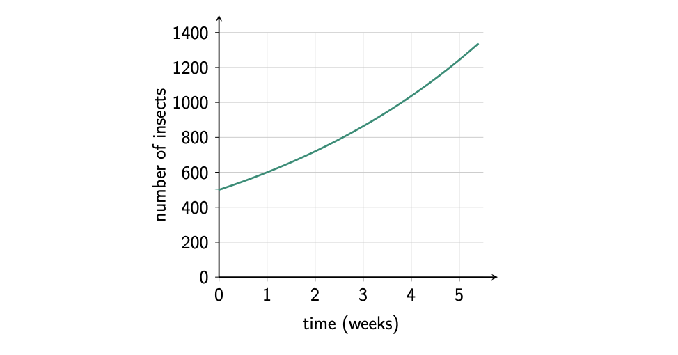
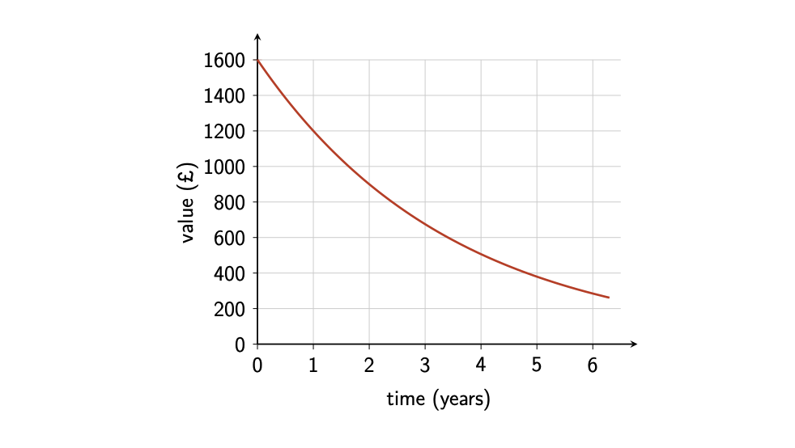
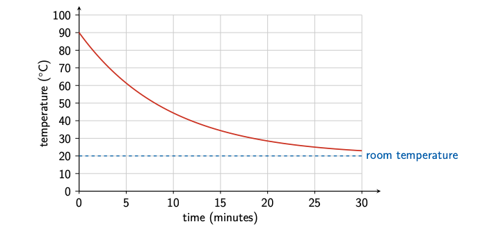

```{r setup, include = FALSE}
knitr::opts_chunk$set(echo = FALSE)
library(webexercises)
```


```{r, echo = FALSE, results='asis'}
# Uncomment to change widget colours:
#style_widgets(incorrect = "goldenrod", correct = "purple")
```

<hr>

### Question 1

A colony of insects initially contains 500 insects. The population increases by \(20\%\) each week.

The graph below models the number of insects $N$ in the colony over time $t$.



Which type of relationship is shown?

`r mcq(c("linear growth", answer = "exponential growth", "linear decay", "exponential decay"))`

Which is the independent variable?

`r mcq(c("number of insects", "percentage increase", "colony", answer = "time"))`

Which is the dependent variable?

`r mcq(c(answer = "number of insects", "percentage increase", "colony", "time"))`

What is the initial population?

`r mcq(c("20 insects", "120 insects", answer = "500 insects", "600 insects"))`

What is the growth multiplier?

`r mcq(c("0.20", "0.80", answer = "1.20", "20"))`

Given that the model has equation \(N=500\times 1.2^t\), approximately how many insects does the model predict after 4 weeks?

`r mcq(c("580 insects", "700 insects", "864 insects", answer = "1037 insects"))`

`r hide("Explanation")`

The curve rises faster and faster, so it shows **exponential growth**.

Time is the independent variable. The number of insects is the dependent variable because the population changes as time passes.

The initial population is \(500\). A \(20\%\) increase gives a growth multiplier of

\[
1+\frac{20}{100}=1.20.
\]

The model is therefore

\[
N=500\times 1.2^t.
\]

After \(4\) weeks,

\[
N=500\times 1.2^4
  =500\times 2.0736
  =1036.8.
\]

The model predicts approximately **1037 insects**.

`r unhide()`

<hr>

### Question 2

A new computer is purchased for £1600. Its value decreases by \(25\%\) each year.

The graph below models the value $V$ of the computer over time $t$.



Which type of relationship is shown?

`r mcq(c("linear growth", "exponential growth", "linear decay", answer = "exponential decay"))`

Which is the independent variable?

`r mcq(c("value of the computer", "percentage decrease", "computer", answer = "time"))`

Which is the dependent variable?

`r mcq(c(answer = "value of the computer", "percentage decrease", "computer", "time"))`

What is the initial value of the computer?

`r mcq(c("£25", "£400", "£1200", answer = "£1600"))`

What is the decay multiplier?

`r mcq(c("0.25", answer = "0.75", "1.25", "25"))`

Given that the model has equation \(V=1600\times 0.75^t\), what value does the model predict after 3 years?

`r mcq(c("£400", answer = "£675", "£850", "£1150"))`

`r hide("Explanation")`

The curve falls quickly at first and then more slowly, so it shows **exponential decay**.

Time is the independent variable. The value of the computer is the dependent variable because its value changes as time passes.

A \(25\%\) decrease means that \(75\%\) of the previous value remains each year. The decay multiplier is therefore

\[
1-\frac{25}{100}=0.75.
\]

The model is

\[
V=1600\times 0.75^t.
\]

After \(3\) years,

\[
V=1600\times 0.75^3
  =1600\times 0.421875
  =675.
\]

The predicted value is **£675**.

Notice that the value is multiplied by \(0.75\) each year. It does not decrease by a fixed number of pounds each year.

`r unhide()`

<hr>

### Question 3

A bowl of soup is placed on a table in a room with a temperature of \(20^\circ\text{C}\).

The temperature \(T\), in degrees Celsius, \(t\) minutes after the soup is placed on the table is modelled by

\[
T=20+70\times 0.9^t.
\]

The graph of the model is shown below.



Which type of relationship is used in the model?

`r mcq(c("linear growth", "exponential growth", "linear decay", answer = "exponential decay"))`

Which is the independent variable?

`r mcq(c("temperature of the soup", "temperature of the room", "bowl of soup", answer = "time"))`

Which is the dependent variable?

`r mcq(c(answer = "temperature of the soup", "temperature of the room", "bowl of soup", "time"))`

What is the temperature of the soup when it is first placed on the table?

`r mcq(c("20 degrees Celsius", "70 degrees Celsius", answer = "90 degrees Celsius", "110 degrees Celsius"))`

What does the number \(20\) represent?

`r mcq(c("The initial temperature of the soup", "The decrease in temperature each minute", answer = "The temperature approached by the soup", "The time taken for the soup to become cold"))`

Approximately what temperature does the model predict after 10 minutes?

`r mcq(c("26.3 degrees Celsius", "37.1 degrees Celsius", answer = "44.4 degrees Celsius", "83.0 degrees Celsius"))`

`r hide("Explanation")`

The temperature decreases quickly at first and then more slowly, so the model describes **exponential decay**.

Time is the independent variable. The temperature of the soup is the dependent variable because the temperature changes as time passes.

At \(t=0\),

\[
T=20+70\times 0.9^0.
\]

Since \(0.9^0=1\),

\[
T=20+70=90^\circ\text{C}.
\]

The initial temperature of the soup is therefore \(90^\circ\text{C}\).

After \(10\) minutes,

\[
T=20+70\times 0.9^{10}
  \approx 20+24.407
  \approx 44.4^\circ\text{C}.
\]

As \(t\) becomes large, the temperature approaches

\[
T=20^\circ\text{C}.
\]

The number \(20\) represents the room temperature, which is the limiting temperature approached by the soup.

`r unhide()`

<hr>

