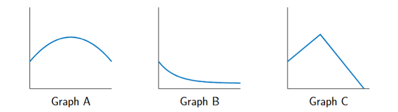

```{r setup, include = FALSE}
knitr::opts_chunk$set(echo = FALSE)
library(webexercises)
```


```{r, echo = FALSE, results='asis'}
# Uncomment to change widget colours:
#style_widgets(incorrect = "goldenrod", correct = "purple")
```

<hr>


### Question 1

A person is standing on a pier. They throw a rock up and out towards the sea, and watch it until it lands in the water.

A model is to be created to describe the height of the rock over time from when it is thrown by the person on the pier.

Which is the independent variable? `r mcq(c("height", "rock","person", answer = "time", "pier"))`

Which is the dependent variable? `r mcq(c(answer = "height", "rock","person", "time", "pier"))`

Which of the three graphs below matches the model? `r mcq(c(answer = "A", "B", "C"))`

What kind of relationship is this? `r mcq(c("linear", answer = "quadratic", "exponential growth", "exponential decay"))`

<hr>

`r hide("Explanation")`

The rock initially travels **up** as described in the question, then smoothly reaches the heights point before smoothly dropping until it his the water, below the pier. Only **graph A** shows this.

Graph B drops first, and then levels out rather than hitting the water.

Graph C is too sharp, travelling upwards at one constant speed then turning to travel down at a constant speed. The rock would change speed gradually over time.

`r unhide()`

<hr>

### Question 2

A person is at the local shop. They walk away from their house towards a park at a steady pace, then change their mind when it starts to rain and turn around promptly and walk back home again at a steady pace.

A model is to be created to describe the distance the person is from their home over time from when they leave the shop.

Which is the dependent variable? `r mcq(c(answer = "distance", "park","person", "time", "home"))`

Which is the independent variable? `r mcq(c("distance", "park","person", answer = "time", "home"))`

Which of the three graphs below matches the model? `r mcq(c("A", "B", answer = "C"))`

<hr>

`r hide("Explanation")`

The person walks first at a **steady pace** away from the shop (and from their home), and then they *promptly* turn and walk at a **steady pace** back home. This description matches **graph C**.

Graph B is always moving back towards their home, and then slows levels out rather than returning home at a steady pace.

Graph A is smooth, showing gradual change rather than a **prompt** one.

`r unhide()`

<hr>

### Question 3

A person leaves a mug of coffee on their desk, and forgets about it.

A model is to be created to describe the temperature of their coffee over time.

Which is the dependent variable? `r mcq(c("mug",answer = "temperature", "coffee","person", "time"))`

Which is the independent variable? `r mcq(c("mug","temperature", "coffee","person", answer = "time"))`

Which of the three graphs below matches the model? `r mcq(c("A", answer = "B", "C"))`

What kind of relationship is this? `r mcq(c("linear", "quadratic", "exponential growth", answer = "exponential decay"))`

<hr>

`r hide("Explanation")`

Both graphs A and C show the temperature rising first.

Only **graph B** shows the coffee cooling, with the temperature levelling out as it approaches room temperature.

`r unhide()`

<hr>
