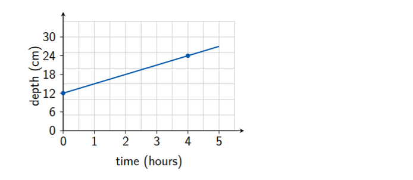
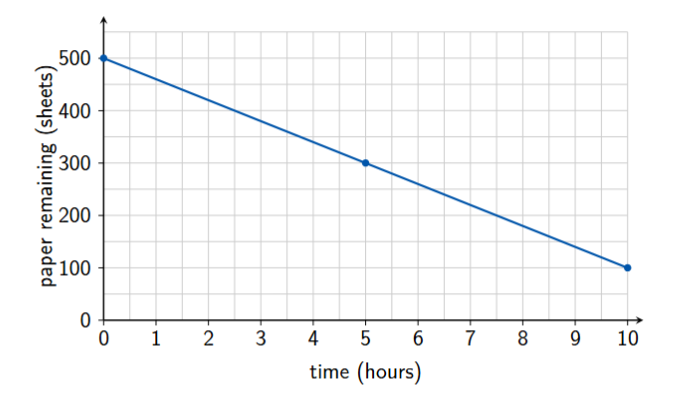
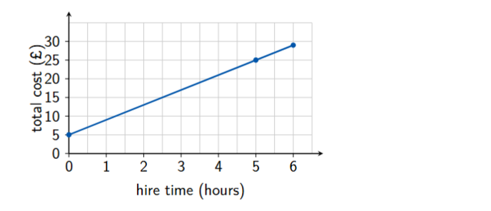

```{r setup, include = FALSE}
knitr::opts_chunk$set(echo = FALSE)
library(webexercises)
```


```{r, echo = FALSE, results='asis'}
# Uncomment to change widget colours:
#style_widgets(incorrect = "goldenrod", correct = "purple")
```

<hr>

### Question 1

During a period of steady rainfall, the depth of water in a garden pond increases at a constant rate.

The graph below shows the relationship between the time since the rain began and the depth of the water.



Which type of relationship is shown?

`r mcq(c(answer = "linear", "quadratic", "exponential growth", "exponential decay"))`

Which is the independent variable?

`r mcq(c("depth of water", answer = "time", "rainfall", "pond"))`

Which is the dependent variable?

`r mcq(c(answer = "depth of water", "time", "rainfall", "pond"))`

What is the starting depth of the water?

`r mcq(c("3 cm", "9 cm", answer = "12 cm", "24 cm"))`

What is the rate of change?

`r mcq(c("1 cm per hour", answer = "3 cm per hour", "6 cm per hour", "12 cm per hour"))`

Which equation describes the relationship, where \(d\) is the depth in centimetres and \(t\) is the time in hours?

`r mcq(c("d = 3 + 12t", answer = "d = 12 + 3t", "d = 12 - 3t", "d = 3t"))`

What depth does the model predict after 5 hours?

`r mcq(c("15 cm", "17 cm", answer = "27 cm", "60 cm"))`

`r hide("Explanation")`

The graph is a **straight line**, so it shows a linear relationship.

Time is the independent variable because it is used to explain or predict the depth of the water. The depth is the dependent variable because it changes as time passes.

At \(t=0\), the graph has a depth of \(12\) cm, so the starting value is \(12\) cm.

The depth increases from \(12\) cm to \(24\) cm over \(4\) hours. Therefore, the rate of change is

\[
\frac{24-12}{4-0}=3\text{ cm per hour}.
\]

The equation is

\[
d=12+3t.
\]

After \(5\) hours,

\[
d=12+3\times 5=27\text{ cm}.
\]

`r unhide()`

<hr>

### Question 2

A printer contains 500 sheets of paper at the beginning of a working day. It uses paper at a constant rate of 40 sheets per hour.

The graph below models the number of sheets remaining.



Which type of relationship is shown?

`r mcq(c(answer = "linear", "quadratic", "exponential growth", "exponential decay"))`

Which is the independent variable?

`r mcq(c("number of sheets", "printer", answer = "time", "paper used"))`

Which is the dependent variable?

`r mcq(c(answer = "number of sheets remaining", "printer", "time", "working day"))`

What is the starting value?

`r mcq(c("40 sheets", "100 sheets", "400 sheets", answer = "500 sheets"))`

What is the rate of change?

`r mcq(c("40 sheets per hour", answer = "-40 sheets per hour", "-100 sheets per hour", "500 sheets per hour"))`

Which equation describes the relationship, where \(P\) is the number of sheets remaining and \(t\) is the number of hours?

`r mcq(c("P = 40 + 500t", "P = 500 + 40t", answer = "P = 500 - 40t", "P = 40 - 500t"))`

How many sheets does the model predict will remain after 6 hours?

`r mcq(c("240 sheets", answer = "260 sheets", "440 sheets", "460 sheets"))`

`r hide("Explanation")`

The graph is a straight line, so the relationship is **linear**.

Time is the independent variable. The number of sheets remaining is the dependent variable because it changes as time passes.

The starting value is \(500\) sheets. The amount decreases by \(40\) sheets each hour, so the rate of change is negative:

\[
-40\text{ sheets per hour}.
\]

The equation is

\[
P=500-40t.
\]

After \(6\) hours,

\[
P=500-40\times 6=260.
\]

The model predicts that **260 sheets** remain.

`r unhide()`

<hr>

### Question 3

A bicycle hire company charges a fixed fee together with an additional charge for each hour that a bicycle is hired.

The graph below shows the relationship between the hire time and the total cost.



Which type of relationship is shown?

`r mcq(c(answer = "linear", "quadratic", "exponential growth", "exponential decay"))`

Which is the independent variable?

`r mcq(c("total cost", "bicycle", "hire company", answer = "hire time"))`

Which is the dependent variable?

`r mcq(c(answer = "total cost", "bicycle", "hire company", "hire time"))`

What is the fixed starting fee?

`r mcq(c("£2", answer = "£5", "£10", "£15"))`

What is the rate of change?

`r mcq(c("£2 per hour", answer = "£4 per hour", "£5 per hour", "£9 per hour"))`

Which equation describes the relationship, where \(C\) is the cost in pounds and \(t\) is the hire time in hours?

`r mcq(c("C = 4 + 5t", answer = "C = 5 + 4t", "C = 5 - 4t", "C = 4t"))`

How much does the model predict it will cost to hire a bicycle for 6 hours?

`r mcq(c("£24", "£26", answer = "£29", "£54"))`

`r hide("Explanation")`

The graph is a straight line, so the relationship is **linear**.

The hire time is the independent variable. The total cost is the dependent variable because the cost depends on the length of time for which the bicycle is hired.

When the hire time is zero, the cost is £5. Therefore, the fixed starting fee is £5.

The cost increases by £4 for every additional hour, so the rate of change is

\[
£4\text{ per hour}.
\]

The equation is

\[
C=5+4t.
\]

For a hire time of \(6\) hours,

\[
C=5+4\times 6=29.
\]

The predicted cost is **£29**.

`r unhide()`

<hr>

