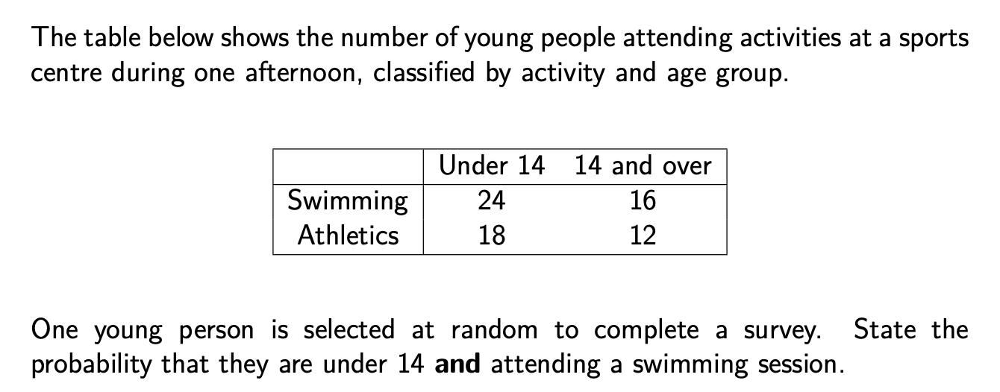
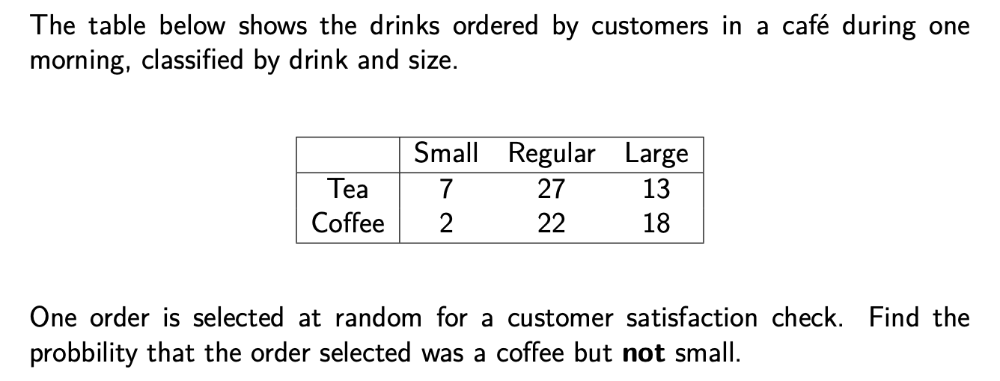
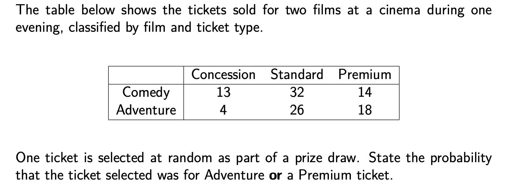

```{r setup, include = FALSE}
knitr::opts_chunk$set(echo = FALSE)
library(webexercises)
```


```{r, echo = FALSE, results='asis'}
# Uncomment to change widget colours:
#style_widgets(incorrect = "goldenrod", correct = "purple")
```


<hr>

### Question 1

<hr>

`r hide("Hint")`

Probability can be found as: $\dfrac{\text{number of "successes"}}{\text{total number}}$.

Start by counting how many young people are on the table altogether.

`r unhide()`

`r hide("Answer")`

$\dfrac{24}{70}$ or $\dfrac{12}{35}$

`r unhide()`

<hr>

### Question 2

<hr>

`r hide("Hint")`

Look at all those which meet the **coffee** condition, then **remove** those which were **small**.

`r unhide()`

`r hide("Answer")`

$\dfrac{40}{89}$

`r unhide()`

<hr>

### Question 3

<hr>

`r hide("Hint")`

For "Adventure **or** Premium", make sure you include **all** those which were Adventure, *and* **all** those which were Premium.

`r unhide()`

`r hide("Answer")`

$\dfrac{62}{107}$

`r unhide()`


