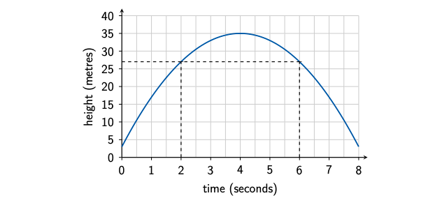
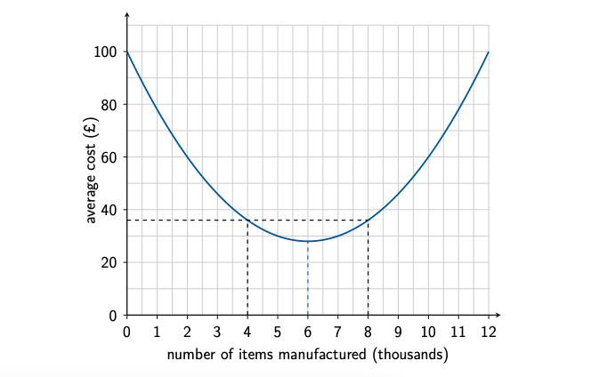

```{r setup, include = FALSE}
knitr::opts_chunk$set(echo = FALSE)
library(webexercises)
```


```{r, echo = FALSE, results='asis'}
# Uncomment to change widget colours:
#style_widgets(incorrect = "goldenrod", correct = "purple")
```

<hr>

### Question 1

The height \(h\) metres of a ball above the ground \(t\) seconds after it is thrown is modelled by

\[
h=-2t^2+12t+5.
\]

Which is the independent variable?

`r mcq(c("height", "ball", "ground", answer = "time"))`

Which is the dependent variable?

`r mcq(c(answer = "height", "ball", "ground", "time"))`

What type of relationship does the equation describe?

`r mcq(c("linear", answer = "quadratic", "exponential growth", "exponential decay"))`

Is the graph a positive or negative parabola?

`r mcq(c("positive parabola", answer = "negative parabola"))`

What is the height of the ball after \(2\) seconds?

`r mcq(c("13 metres", answer = "21 metres", "25 metres", "37 metres"))`

What is the starting height of the ball?

`r mcq(c("0 metres", "2 metres", answer = "5 metres", "12 metres"))`

`r hide("Explanation")`

Time is the **independent variable** because it is the input to the model. The height of the ball depends on how much time has passed, so height is the **dependent variable**.

The equation contains a squared term, \(t^2\), so it describes a **quadratic relationship**.

The coefficient of \(t^2\) is negative, so the graph is a **negative parabola**. It rises to a maximum height and then falls.

To calculate the height after \(2\) seconds, substitute \(t=2\):

\[
\begin{aligned}
h&=-2(2)^2+12(2)+5\\
 &=-2(4)+24+5\\
 &=-8+24+5\\
 &=21.
\end{aligned}
\]

The height of the ball after \(2\) seconds is **21 metres**.

The starting height is found by substituting \(t=0\):

\[
h=-2(0)^2+12(0)+5=5.
\]

Therefore, the ball was thrown from a height of **5 metres**.

`r unhide()`

<hr>

### Question 2

A jet of water is projected upwards from a fountain. Its height \(h\) metres after \(t\) seconds is modelled by

\[
h=-2t^2+16t+3.
\]

The graph of the model is shown below.



What type of relationship is shown?

`r mcq(c("linear", answer = "quadratic", "exponential growth", "exponential decay"))`

At which two times is the water at the same height?

`r mcq(c("1 second and 5 seconds", answer = "2 seconds and 6 seconds", "2 seconds and 8 seconds", "4 seconds and 6 seconds"))`

Use the symmetry of the graph to determine when the water reaches its greatest height.

`r mcq(c("2 seconds", "3 seconds", answer = "4 seconds", "6 seconds"))`

What is the greatest height reached by the water?

`r mcq(c("19 metres", "27 metres", answer = "35 metres", "67 metres"))`

Which statement best describes the meaning of the maximum point?

`r mcq(c(
  "The water begins to fall after 2 seconds.",
  "The water reaches the ground after 4 seconds.",
  answer = "The water reaches a greatest height of 35 metres after 4 seconds.",
  "The water remains at a height of 35 metres."
))`

`r hide("Explanation")`

The graph is a **parabola**, so the relationship is quadratic.

From the graph, the water is at the same height after \(2\) seconds and after \(6\) seconds.

A parabola is symmetrical. The time at the axis of symmetry is halfway between these two times:

\[
\frac{2+6}{2}=4.
\]

Therefore, the water reaches its greatest height after \(4\) seconds.

Substitute \(t=4\) into the model:

\[
\begin{aligned}
h&=-2(4)^2+16(4)+3\\
 &=-2(16)+64+3\\
 &=-32+64+3\\
 &=35.
\end{aligned}
\]

The water reaches a greatest height of **35 metres after 4 seconds**.

`r unhide()`

<hr>

### Question 3

The average cost \(A\) pounds of manufacturing an item is modelled by

\[
A=2x^2-24x+100,
\]

where \(x\) is the number of **thousands of items** manufactured.

The graph of the model is shown below.



Which is the independent variable?

`r mcq(c(
  "average manufacturing cost",
  "number of individual items",
  answer = "number of thousands of items manufactured",
  "time spent manufacturing"
))`

Which is the dependent variable?

`r mcq(c(
  answer = "average manufacturing cost",
  "number of thousands of items manufactured",
  "factory",
  "time"
))`

Is the graph a positive or negative parabola?

`r mcq(c(answer = "positive parabola", "negative parabola"))`

The average costs for \(x=4\) and \(x=8\) are equal. Use symmetry to determine the value of \(x\) at which the average cost is lowest.

`r mcq(c("4", "5", answer = "6", "8"))`

How many items does \(x=6\) represent?

`r mcq(c("6 items", "600 items", answer = "6,000 items", "60,000 items"))`

What is the minimum average manufacturing cost?

`r mcq(c(answer = "£28", "£56", "£72", "£100"))`

Which interpretation of the model is correct?

`r mcq(c(
  "Producing 6 items gives a minimum average cost of £28.",
  answer = "Producing 6,000 items gives a minimum average cost of £28.",
  "Producing 28,000 items gives a minimum average cost of £6.",
  "Producing 6,000 items gives a maximum average cost of £28."
))`

`r hide("Explanation")`

The input \(x\) represents the number of **thousands of items manufactured**, so this is the independent variable.

The average manufacturing cost depends on the number of items manufactured, so average cost is the dependent variable.

The coefficient of \(x^2\) is positive. Therefore, the graph is a **positive parabola** with a minimum point.

The costs at \(x=4\) and \(x=8\) are equal. By symmetry, the minimum lies halfway between these values:

\[
\frac{4+8}{2}=6.
\]

Since \(x\) is measured in thousands, \(x=6\) represents

\[
6\times 1000=6000\text{ items}.
\]

Substitute \(x=6\) into the equation:

\[
\begin{aligned}
A&=2(6)^2-24(6)+100\\
 &=2(36)-144+100\\
 &=72-144+100\\
 &=28.
\end{aligned}
\]

The model predicts that the lowest average manufacturing cost is **£28 per item**, achieved when **6,000 items** are manufactured.

`r unhide()`

<hr>

