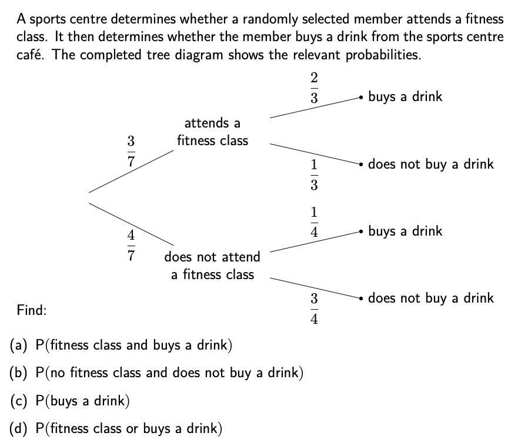
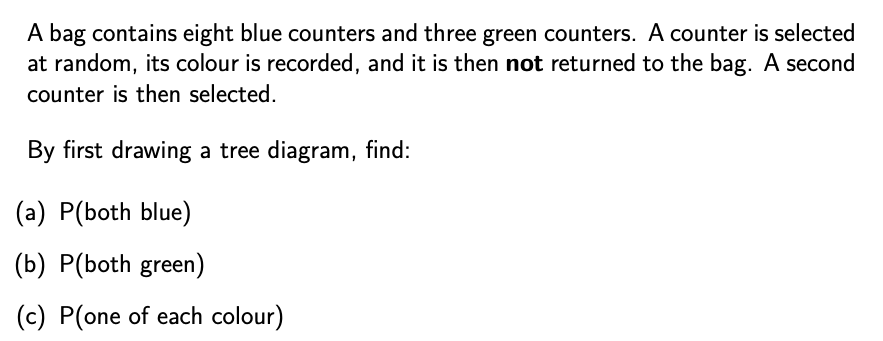
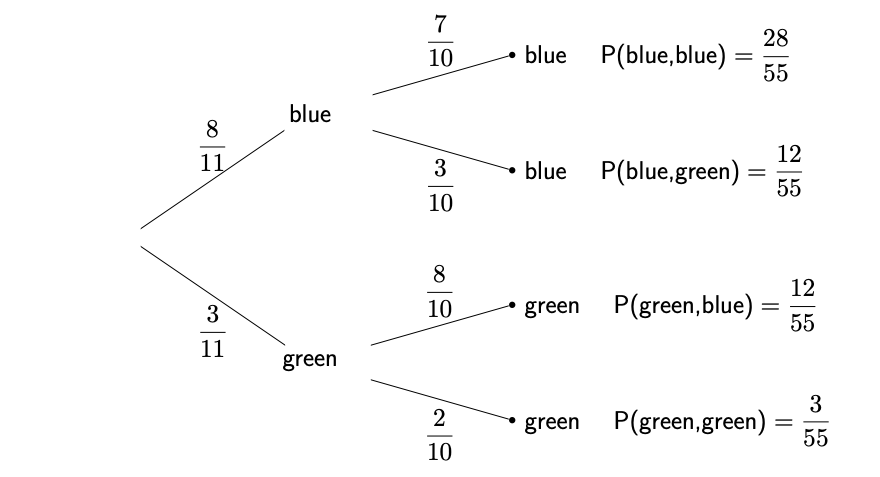

```{r setup, include = FALSE}
knitr::opts_chunk$set(echo = FALSE)
library(webexercises)
```


```{r, echo = FALSE, results='asis'}
# Uncomment to change widget colours:
#style_widgets(incorrect = "goldenrod", correct = "purple")
```


<hr>

### Question 1

<hr>

`r hide("Hint")`

Multiplying along a chain gives the probability of both those events happening.

For example, P(attends a fitness class **and** buys a drink) $=\dfrac{3}{7}\times\dfrac{2}{3}=\dfrac{2}{7}$.

Some parts involve adding together several of these end probabilities.

`r unhide()`

`r hide("Answer")`

(a) P(fitness class and buys a drink) $=\dfrac{3}{7}\times\dfrac{2}{3}=\dfrac{2}{7}$

(b) P(no fitness class and does not buy a drink) $=\dfrac{4}{7}\times\dfrac{3}{4}=\dfrac{3}{7}$

(c) P(buys a drink) $=\dfrac{2}{7}+\dfrac{1}{7}=\dfrac{3}{7}$

(d) P(fitness class or buys a drink) $=\dfrac{2}{7}+\dfrac{1}{7}+\dfrac{1}{7}=\dfrac{4}{7}$

`r unhide()`

<hr>

### Question 2

<hr>

`r hide("Answer")`

(a) P(both blue) $=\dfrac{28}{55}$
(b) P(both green) $=\dfrac{3}{55}$
(c) P(one of each colour) $=\dfrac{12}{55}+\dfrac{12}{55}=\dfrac{24}{55}$

`r unhide()`

`r hide("Completed tree diagram")`



`r unhide()`


