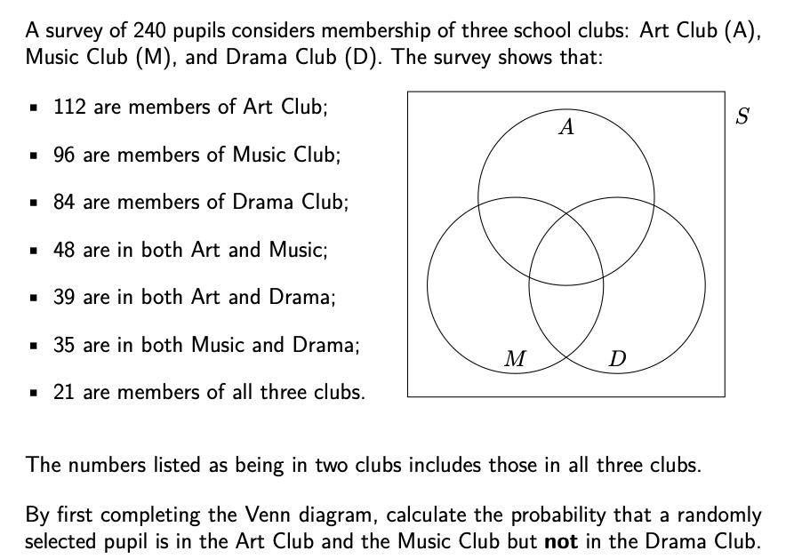
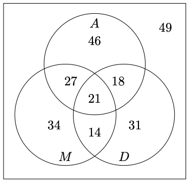
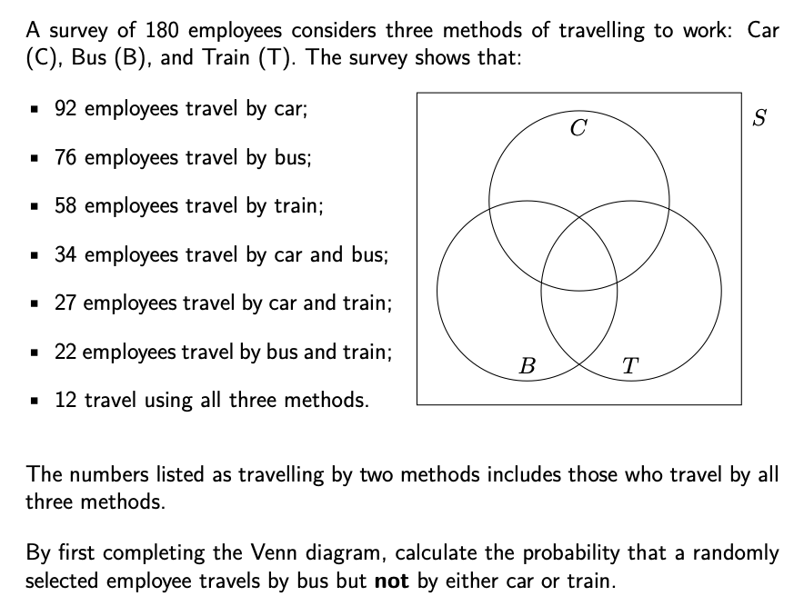
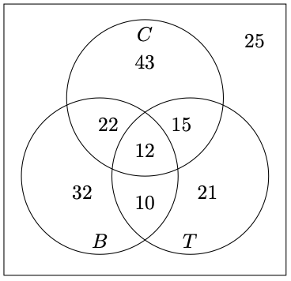

```{r setup, include = FALSE}
knitr::opts_chunk$set(echo = FALSE)
library(webexercises)
```


```{r, echo = FALSE, results='asis'}
# Uncomment to change widget colours:
#style_widgets(incorrect = "goldenrod", correct = "purple")
```


<hr>

### Question 1

<hr>

`r hide("Hint")`

Start with the 21 belonging to all three clubs. Next, remember that the 48 in Art and Music includes those 21 in the middle. So how many should go in the other part of the diagram representing Art and Music?

`r unhide()`

`r hide("Answer")`

$\dfrac{27}{240}$ or $\dfrac{9}{80}$

`r unhide()`

`r hide("Completed Venn diagram")`


`r unhide()`

<hr>

### Question 2

<hr>

`r hide("Answer")`

$\dfrac{32}{180}$ or $\dfrac{8}{45}$

`r unhide()`

`r hide("Completed Venn diagram")`


`r unhide()`
